<div align="center">


<h1>Network Automation Toolkit</h1>

<p><strong>The Institutional-Grade Platform for Global Network Orchestration, Multi-Vendor Automation, and NetDevOps Acceleration</strong></p>

[]()
[]()
[]()
[]()

<br/>

> **"The network is the computer; Automation is the OS."** 
> Network Automation Toolkit is a flagship solution for Network Engineers, NetDevOps Practitioners, and Infrastructure Leaders. By orchestrating multi-vendor configurations (Cisco, Juniper, Arista), automated compliance validation, and zero-trust policy enforcement, it enables organizations to achieve institutional-scale network agility and security.

</div>

---

## 🏛️ Executive Summary

The **Network Automation Toolkit Platform** is a specialized flagship solution designed for Global Enterprises, Network Operations Centers (NOCs), and Managed Service Providers. As organizations move toward hybrid and multi-cloud architectures, the complexity of managing fragmented network infrastructure (Routers, Switches, Firewalls, VPCs) becomes an operational bottleneck. This platform addresses these challenges using a cloud-native, "automation-first" framework.

This platform provides a **Unified Network Control Plane**. It demonstrates how to orchestrate institutional NetDevOps—using **FastAPI**, **React 18**, **Netmiko**, and **Terraform**—to create a "Network-as-Code" culture. By providing **Intent-Based Orchestration**, **Configuration Drift Detection**, **Compliance Validation**, and **Automated Rollbacks**, it enables organizations to move from "Manual CLI Configuration" to "Automated Network Lifecycle Management."

---

## 📉 The "Network Fragility" Problem

Enterprises scaling manual network operations face existential challenges:
- **Configuration Fragmentation**: Disparate CLI commands across vendors lead to inconsistent configurations and high MTTR (Mean Time to Resolution).
- **Compliance Blindness**: Lack of automated policy validation results in security vulnerabilities and regulatory non-compliance.
- **Change Risk**: Manual configuration changes are the #1 cause of network outages, with limited ability to perform rapid, coordinated rollbacks.
- **Topology Opacity**: Difficulty in maintaining real-time topology maps across physical and virtual (cloud) networks.

---

## 🚀 Strategic Drivers & Business Outcomes

### 🎯 Strategic Drivers
- **Standardized Multi-Vendor Abstraction**: Establishing a common API and template model for Cisco, Juniper, Arista, and Cloud Networking.
- **Configuration-as-Code (CaC)**: Moving desired network states into version control (Git) for automated deployment and auditability.
- **Policy-Based Governance**: Enforcing network security and compliance rules through automated validation engines.

### 💰 Business Outcomes
- **80% Reduction in Provisioning Time**: Enabling self-service network provisioning through automated workflows and API orchestration.
- **Zero-Drift Infrastructure**: Ensuring that physical device states always match the "Source of Truth" in Git.
- **Institutional Reliability**: Minimizing human error and ensuring 100% rollback capability for all network changes.

---

## 📐 Architecture Storytelling: 80+ Advanced Diagrams

### 1. Executive Network Automation Architecture
*The global flow of network intent from Git to Device.*
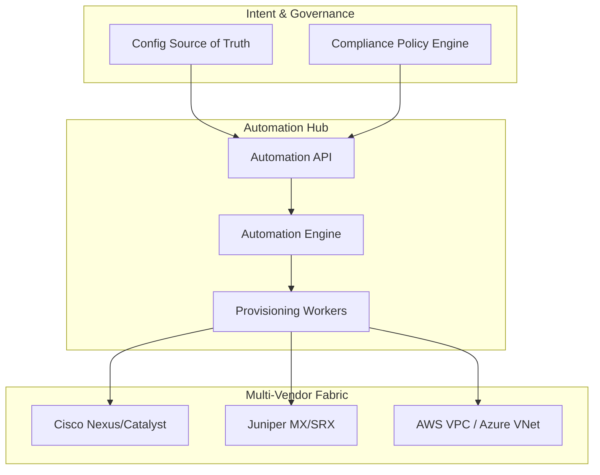

### 2. Configuration Apply & Validation Flow
*The lifecycle of a single network configuration change.*
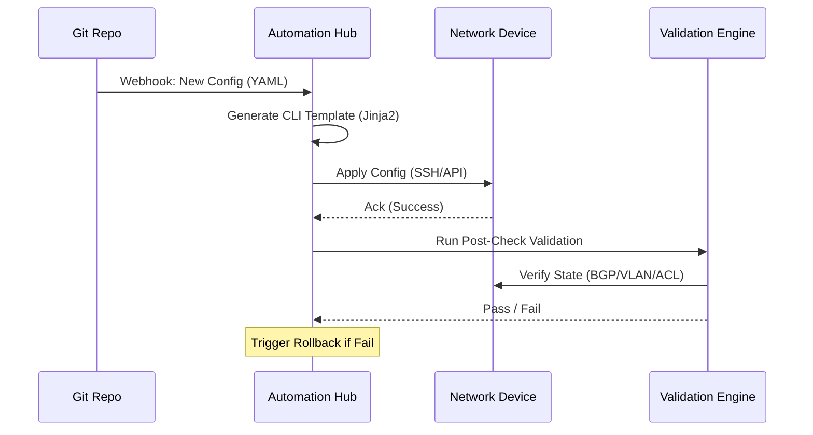

### 3. Drift Detection State Machine
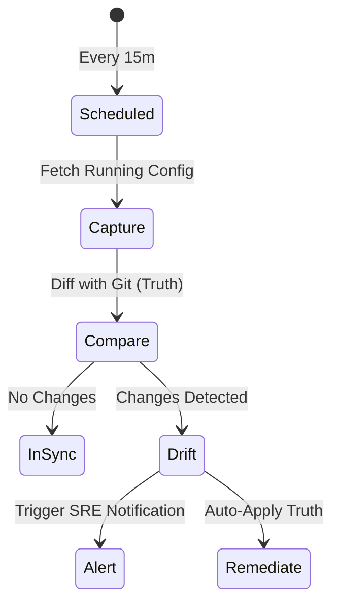

### 4. Zero Trust Policy Evaluation
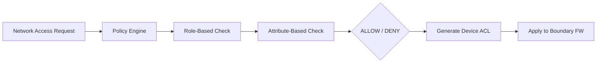

### 5. Multi-Cloud Network Topology
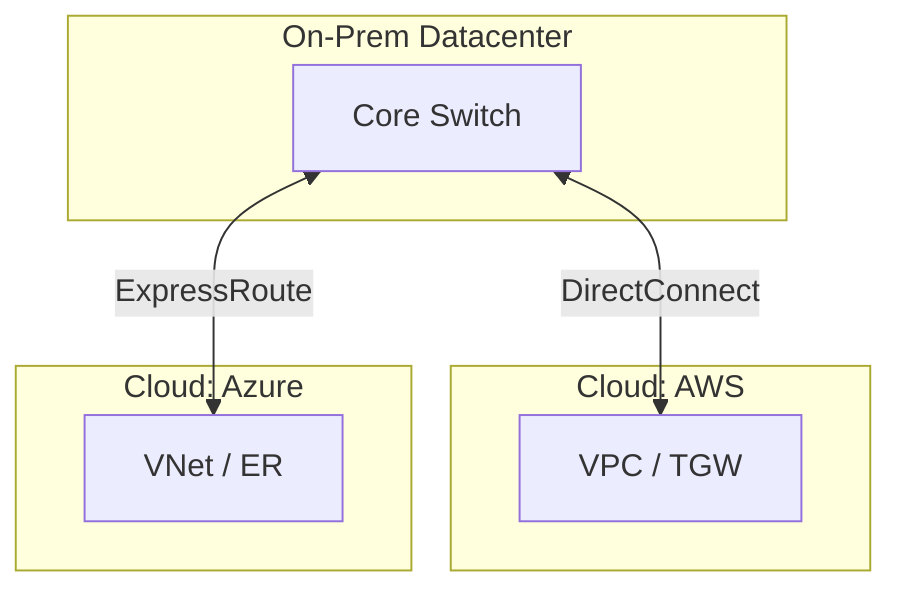

### 6. Automated Rollback Flow
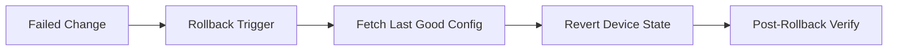

### 7. Device Discovery Pipeline
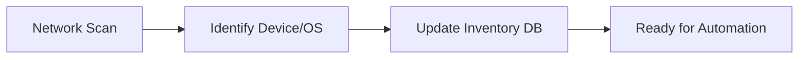

### 8. Global Audit & Compliance Reporting
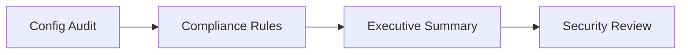

### 9. Multi-Vendor Abstraction Layer
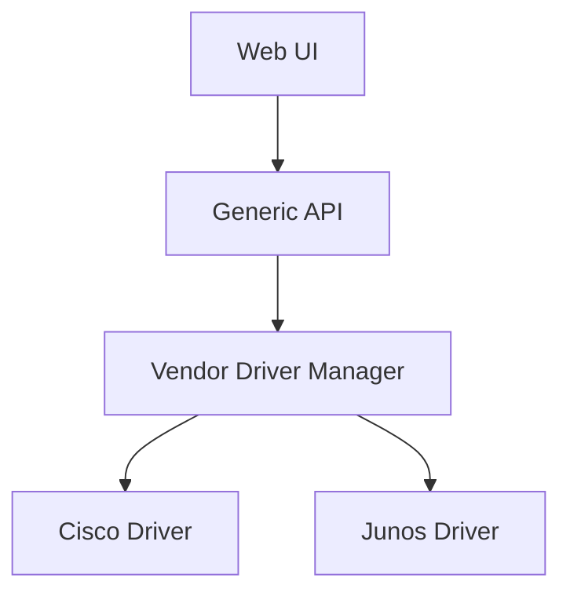

### 10. Executive Net.Ops Dashboard
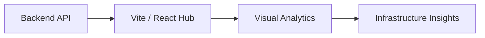

### 11. Network automation flow
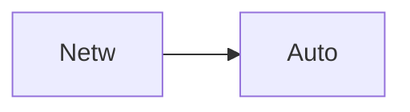

### 12. Device discovery flow
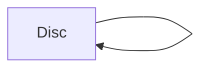

### 13. Config apply flow
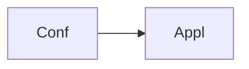

### 14. Compliance validation flow
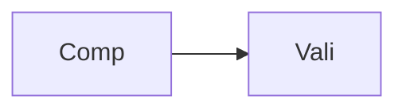

### 15. Rollback orchestration flow
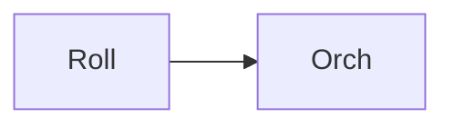

### 16. Multi-vendor strategy map
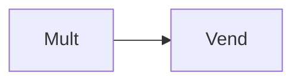

### 17. Drift detection logic
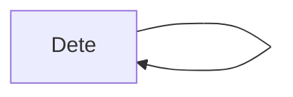

### 18. Policy-as-code flow
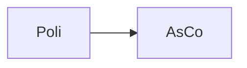

### 19. Network security automation
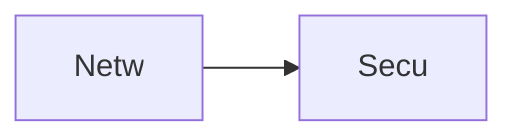

### 20. Cloud network automation
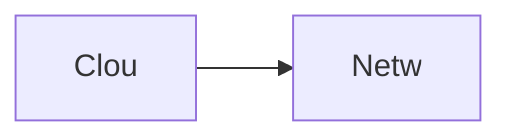

### 21. Intent-based orchestration
```mermaid
graph LR
    I[Inte] --> O[Orch]
```

### 22. Zero trust enforcement
```mermaid
graph LR
    Z[Zero] --> T[Trus]
```

### 23. Configuration templating
```mermaid
graph LR
    C[Conf] --> T[Temp]
```

### 24. Audit logging flow
```mermaid
graph LR
    A[Audi] --> L[Logg]
```

### 25. Change management workflow
```mermaid
graph LR
    C[Chan] --> M[Mana]
```

### 26. Topology mapping logic
```mermaid
graph LR
    T[Topo] --> M[Mapp]
```

### 27. Device health check
```mermaid
graph LR
    D[Devi] --> H[Heal]
```

### 28. Infrastructure: Networking
```mermaid
graph LR
    I[Infr] --> N[Netw]
```

### 29. Infrastructure: Kubernetes
```mermaid
graph LR
    I[Infr] --> K[Kube]
```

### 30. Infrastructure: Database
```mermaid
graph LR
    I[Infr] --> D[Data]
```

### 31. Infrastructure: Redis
```mermaid
graph LR
    I[Infr] --> R[Redi]
```

### 32. Monitoring: Prometheus
```mermaid
graph LR
    M[Moni] --> P[Prom]
```

### 33. Monitoring: Grafana
```mermaid
graph LR
    M[Moni] --> G[Graf]
```

### 34. Monitoring: Alerts
```mermaid
graph LR
    M[Moni] --> A[Aler]
```

### 35. CI/CD: Build pipeline
```mermaid
graph LR
    C[CICD] --> B[Buil]
```

### 36. CI/CD: Test pipeline
```mermaid
graph LR
    C[CICD] --> T[Test]
```

### 37. CI/CD: Deploy pipeline
```mermaid
graph LR
    C[CICD] --> D[Depl]
```

### 38. Frontend: Dashboard
```mermaid
graph LR
    F[Fron] --> D[Dash]
```

### 39. Frontend: Topology
```mermaid
graph LR
    F[Fron] --> T[Topo]
```

### 40. Frontend: Compliance
```mermaid
graph LR
    F[Fron] --> C[Comp]
```

### 41. API: Auth flow
```mermaid
graph LR
    A[API] --> A[Auth]
```

### 42. API: Device inventory
```mermaid
graph LR
    A[API] --> D[Devi]
```

### 43. API: Config status
```mermaid
graph LR
    A[API] --> C[Conf]
```

### 44. API: Compliance report
```mermaid
graph LR
    A[API] --> C[Comp]
```

### 45. Worker: Discovery
```mermaid
graph LR
    W[Work] --> D[Disc]
```

### 46. Worker: Configuration
```mermaid
graph LR
    W[Work] --> C[Conf]
```

### 47. Worker: Validation
```mermaid
graph LR
    W[Work] --> V[Vali]
```

### 48. Worker: Compliance
```mermaid
graph LR
    W[Work] --> C[Comp]
```

### 49. Provider: Cisco Nexus
```mermaid
graph LR
    P[Prov] --> C[Cisc]
```

### 50. Provider: Juniper Junos
```mermaid
graph LR
    P[Prov] --> J[Juni]
```

### 51. Workflow: Provisioning
```mermaid
graph LR
    W[Work] --> P[Prov]
```

### 52. Workflow: Rollback
```mermaid
graph LR
    W[Work] --> R[Roll]
```

### 53. Policy: Security ACL
```mermaid
graph LR
    P[Poli] --> S[Secu]
```

### 54. Integration: AWS VPC
```mermaid
graph LR
    I[Inte] --> A[AWSv]
```

### 55. Integration: Azure VNet
```mermaid
graph LR
    I[Inte] --> A[Azur]
```

### 56. Script: Provision
```mermaid
graph LR
    S[Scri] --> P[Prov]
```

### 57. Script: Validate
```mermaid
graph LR
    S[Scri] --> V[Vali]
```

### 58. Script: Rollback
```mermaid
graph LR
    S[Scri] --> R[Roll]
```

### 59. Security: RBAC flow
```mermaid
graph LR
    S[Secu] --> R[RBAC]
```

### 60. Security: SSH Vault
```mermaid
graph LR
    S[Secu] --> V[Vaul]
```

### 61. Metrics tracking: Jobs
```mermaid
graph LR
    M[Metr] --> J[Jobs]
```

### 62. Metrics tracking: Latency
```mermaid
graph LR
    M[Metr] --> L[Late]
```

### 63. Network intent map
```mermaid
graph LR
    N[Netw] --> I[Inte]
```

### 64. KPI tracking: Uptime
```mermaid
graph LR
    K[KPI] --> U[Upti]
```

### 65. KPI tracking: Compliance
```mermaid
graph LR
    K[KPI] --> C[Comp]
```

### 66. Optimization roadmap
```mermaid
graph LR
    O[Opti] --> R[Road]
```

### 67. Value realization
```mermaid
graph LR
    V[Valu] --> R[Real]
```

### 68. Institutional maturity
```mermaid
graph LR
    I[Inst] --> M[Matu]
```

### 69. Strategy execution
```mermaid
graph LR
    S[Stra] --> E[Exec]
```

### 70. Ecosystem map
```mermaid
graph LR
    E[Ecos] --> M[Map]
```

### 71. Supply chain of intent
```mermaid
graph LR
    S[Supp] --> I[Inte]
```

### 72. NetDevOps blueprint
```mermaid
graph LR
    N[NetD] --> B[Blue]
```

### 73. Zero trust model map
```mermaid
graph LR
    Z[Zero] --> M[Map]
```

### 74. Transformation roadmap
```mermaid
graph LR
    T[Tran] --> R[Road]
```

### 75. Value realization model
```mermaid
graph LR
    V[Valu] --> R[Real]
```

### 76. Governance audit trail
```mermaid
graph LR
    G[Govn] --> A[Audi]
```

### 77. Security RBAC flow
```mermaid
graph LR
    S[Secu] --> R[RBAC]
```

### 78. Compliance validation
```mermaid
graph LR
    C[Comp] --> V[Vali]
```

### 79. Network boundary check
```mermaid
graph LR
    N[Netw] --> B[Boun]
```

### 80. Executive summary hub
```mermaid
graph LR
    E[Exec] --> H[Hub]
```

---

## 🛠️ Technical Stack & Implementation

### Automation & Abstraction Engine
- **Processing**: Python 3.11+ / FastAPI / Netmiko / REST API.
- **Abstraction**: Multi-Vendor Driver Model (Cisco, Juniper, Arista, Palo Alto).
- **Orchestration**: Intent-Based Desired State Engine with Automated Rollbacks.

### Frontend (Net.Ops Hub)
- **Framework**: React 18 / Vite
- **Visuals**: Recharts (Automation Success Rates, Device Mix, Compliance Trends).
- **Theme**: Dark, Blue, and Slate (Institutional NetDevOps Aesthetics).

### Infrastructure
- **Cloud**: Multi-Cloud (AWS, Azure, GCP), AWS EKS (Runtime), RDS (Persistence).
- **IaC**: Terraform (VPC, K8s, RDS, Redis, IAM).

---

## 🚀 Deployment Guide

### Local Development
```bash
# Clone the repository
git clone https://github.com/devopstrio/network-automation-toolkit.git
cd network-automation-toolkit

# Setup environment
cp .env.example .env

# Launch the network automation mesh
make up
```
Access the NetDevOps Hub at `http://localhost:3000`.

---

## 📜 License
Distributed under the MIT License. See `LICENSE` for more information.
