<div align="center">


<h1>Network Automation Toolkit</h1>

<p><strong>The Institutional-Grade Platform for Global Network Orchestration, Multi-Vendor Automation, and NetDevOps Acceleration.</strong></p>

[]()
[]()
[]()

<br/>

> **"The network is the computer; Automation is the OS."** 
> **Network Automation Toolkit** is an enterprise-grade platform designed to provide a secure, measurable, and highly automated foundation for global network operations. It orchestrates the complex lifecycle of network infrastructure—from multi-vendor intent-based orchestration and CI/CD-driven provisioning to automated IPAM and unified NetDevOps governance.

</div>

---

## 🏛️ Executive Summary

Fragmented network configurations and manual CLI-based management are strategic operational liabilities; lack of centralized network automation is a primary barrier to organizational agility. Organizations fail to achieve rapid network scaling not because of a lack of hardware, but because of fragmented configuration standards, lack of automated validation, and an inability to orchestrate network intent with operational precision.

This platform provides the **Automation Intelligence Plane**. It implements a complete **Enterprise NetDevOps-as-Code Framework**, enabling Network and Platform teams to manage global infrastructure as a first-class citizen. By automating the provisioning of complex network fabrics and orchestrating real-time intent validation, we ensure that every organizational asset—from core datacenter switches to multi-cloud transit gateways—is automated by default, audited for history, and strictly aligned with institutional NetDevOps frameworks.

---

## 📐 Architecture Storytelling: Principal Reference Models

### 1. Principal Architecture: Global Network Automation & Intent-Based Orchestration Plane
This diagram illustrates the end-to-end flow from network intent definition and multi-vendor abstraction to automated provisioning, validation, and institutional NetDevOps auditing.

```mermaid
graph LR
    %% Subgraph Definitions
    subgraph IntentDefinition["Network Intent & Desired State"]
        direction TB
        YAML["YAML/JSON Intent Specs"]
        Templates["Jinja2 Device Templates"]
        Policy["Compliance Baselines (NIST)"]
    end

    subgraph IntelligenceEngine["Automation Intelligence Hub"]
        direction TB
        API["FastAPI Orchestration Gateway"]
        Abstraction["Multi-Vendor Abstraction Layer"]
        Validator["Pre/Post-Check Engine"]
        Orchestrator["Task & Workflow Scheduler"]
    end

    subgraph ExecutionPlane["Distributed Execution Fleet"]
        direction TB
        CiscoDriver["Cisco Nexus/IOS Workers"]
        JuniperDriver["Junos/SRX Workers"]
        CloudDriver["AWS/Azure/GCP Workers"]
    end

    subgraph OperationsHub["Institutional NetDevOps Hub"]
        direction TB
        Scorecard["Automation Maturity Score"]
        Analytics["Change Success & MTTR Stats"]
        Audit["Forensic Automation Metadata Lake"]
    end

    subgraph DevOps["NetDevOps-as-Code Orchestration"]
        direction TB
        Git["GitOps Config Repository"]
        CI["Testing & Linting Pipeline"]
        ChatOps["ChatOps Approval Hub"]
    end

    %% Flow Arrows
    IntentDefinition -->|1. Submit Intent| API
    API -->|2. Resolve Abstraction| Abstraction
    Abstraction -->|3. Validate Intent| Validator
    Validator -->|4. Orchestrate Tasks| Orchestrator
    
    Orchestrator -->|5. Execute Change| ExecutionPlane
    ExecutionPlane -->|6. Verify State| Validator
    Validator -->|7. Notify Result| ChatOps
    
    API -->|8. Visualize Health| Scorecard
    Scorecard -->|9. Track Success| Analytics
    Scorecard -->|10. Record Event| Audit
    
    Git -->|11. Trigger Change| CI
    CI -->|12. Validate & Push| API
    Audit -->|13. Improve Templates| IntentDefinition

    %% Styling
    classDef intent fill:#f5f5f5,stroke:#616161,stroke-width:2px;
    classDef intel fill:#fffde7,stroke:#fbc02d,stroke-width:2px;
    classDef execution fill:#e8f5e9,stroke:#1b5e20,stroke-width:2px;
    classDef ops fill:#ede7f6,stroke:#311b92,stroke-width:2px;
    classDef devops fill:#e1f5fe,stroke:#01579b,stroke-width:2px;

    class IntentDefinition intent;
    class IntelligenceEngine intel;
    class ExecutionPlane execution;
    class OperationsHub ops;
    class DevOps devops;
```

### 2. The Network Automation Lifecycle Flow
The continuous path of a network change from initial intent definition and validation to active provisioning, monitoring, and institutional forensic auditing.

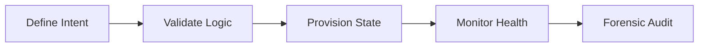

### 3. CI/CD for Network Infrastructure
Strategically integrating network configuration changes into a unified CI/CD pipeline, ensuring that every firewall rule and routing update is linted, tested, and approved before deployment.

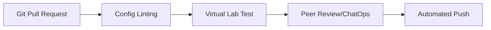

### 4. IPAM & Subnet Orchestration Flow
Automating the management of the global IP address space (IPv4/IPv6), providing a single source of truth for CIDR allocation, subnet reservation, and DHCP/DNS synchronization.

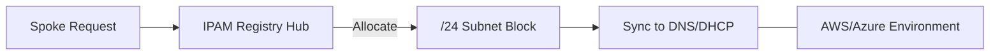

### 5. Transit Gateway & Peering Automation
Orchestrating the complex lifecycle of multi-cloud transit gateways, VPC peering, and site-to-site VPNs through automated API calls and infrastructure-as-code updates.

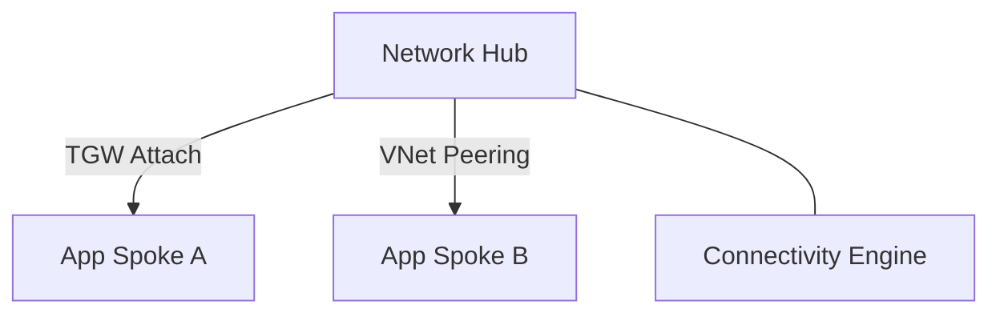

### 6. Self-Healing Network Remediation
Automatically responding to network failures—such as routing loops, port exhaustion, or BGP flapping—by triggering pre-validated remediation workflows and rolling back unsafe changes.

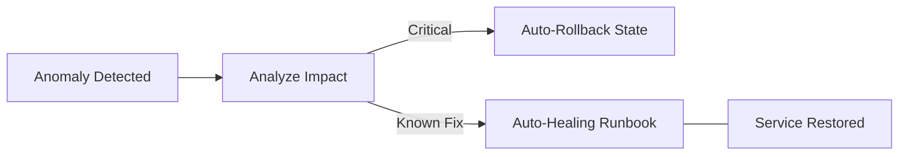

### 7. Institutional Network Automation Scorecard
Grading organizational performance based on key indicators: Automation Coverage (CLI vs API), Change Success Rate, and Mean Time to Provision (MTTP).

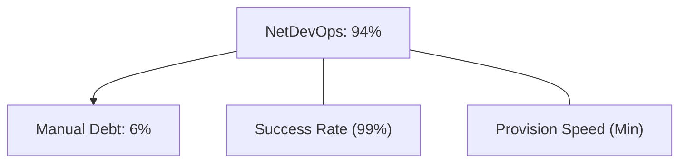

### 8. Identity & RBAC for NetDevOps Governance
Managing fine-grained access to automation workers, device templates, and audit logs between Network Engineers, Automation Developers, and Compliance Leads.

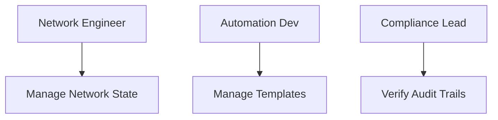

### 9. IaC Deployment: Network-as-Code Framework
Using modular Terraform to deploy and manage the versioned distribution of the automation hubs, execution workers, and forensic metadata lakes.

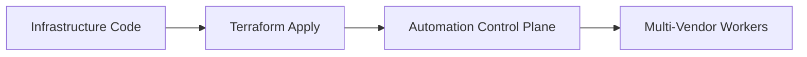

### 10. AIOps Network Intent Validation Flow
Using advanced logic engines to identify conflicts between the "Desired Intent" and the "Live Actual Config," flagging unauthorized manual changes and ensuring 100% drift resolution.

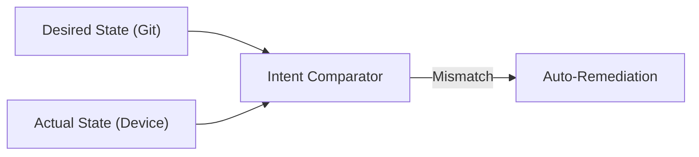

### 11. Metadata Lake for Forensic Automation Audit
Storing long-term records of every automated change, validation result, and device response for institutional record-keeping, compliance auditing, and post-incident investigation.

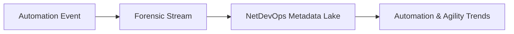

---

## 🏛️ Core Automation Pillars

1.  **Multi-Vendor Intent Abstraction**: Establishing a unified model for managing Cisco, Juniper, and Cloud platforms.
2.  **Configuration-as-Code (CaC)**: Shifting network management to version-controlled, collaborative workflows.
3.  **Automated Pre/Post-Check Validation**: Guaranteeing that every change is safe before it reaches production.
4.  **Zero-Trust Policy Enforcement**: Automating the deployment of identity-aware network security controls.
5.  **Self-Healing Network Resiliency**: Reducing downtime through automated incident response and rapid rollbacks.
6.  **Full Automation Auditability**: Immutable recording of every network change and device interaction for institutional forensics.

---

## 🛠️ Technical Stack & Implementation

### Automation Engine & APIs
*   **Framework**: Python 3.11+ / FastAPI.
*   **Abstraction Layer**: Netmiko, Nornir, and Napalm for multi-vendor device interaction.
*   **Validation Core**: Batfish and custom Pytest-based network validation logic.
*   **Persistence**: PostgreSQL (Metadata Lake) and Redis (Task Queue).
*   **Auth Orchestrator**: Federated OIDC/SAML with HashiCorp Vault for secure credential injection.

### NetDevOps Dashboard (UI)
*   **Framework**: React 18 / Vite.
*   **Theme**: Dark, Blue, Slate (Modern high-fidelity operational aesthetic).
*   **Visualization**: Recharts for automation success trends, device health heatmaps, and MTTP analytics.

### Infrastructure & DevOps
*   **Runtime**: AWS EKS or Azure Kubernetes Service (AKS).
*   **Connectivity**: Integrated SSH proxying and API gateways for multi-vendor device access.
*   **IaC**: Modular Terraform for deploying the automation hub and execution distributions.

---

## 🏗️ IaC Mapping (Module Structure)

| Module | Purpose | Real Services |
| :--- | :--- | :--- |
| **`infrastructure/auto_hub`** | Central management plane | EKS, PostgreSQL, Redis |
| **`infrastructure/workers`** | Multi-vendor execution fleet | Python, Netmiko, SSH |
| **`infrastructure/vault`** | Secure credential management | HashiCorp Vault, KMS |
| **`infrastructure/auditing`** | Forensic automation sinks | S3, Athena, Quicksight |

---

## 🚀 Deployment Guide

### Local Principal Environment
```bash
# Clone the automation platform
git clone https://github.com/devopstrio/network-automation-toolkit.git
cd network-automation-toolkit

# Configure environment
cp .env.example .env

# Launch the Automation stack
make init

# Trigger a mock intent-based provisioning and validation simulation
make simulate-automation
```

Access the NetDevOps Hub at `http://localhost:3000`.

---

## 📜 License
Distributed under the MIT License. See `LICENSE` for more information.

---
<div align="center">
  <p>© 2026 Devopstrio. All rights reserved.</p>
</div>
