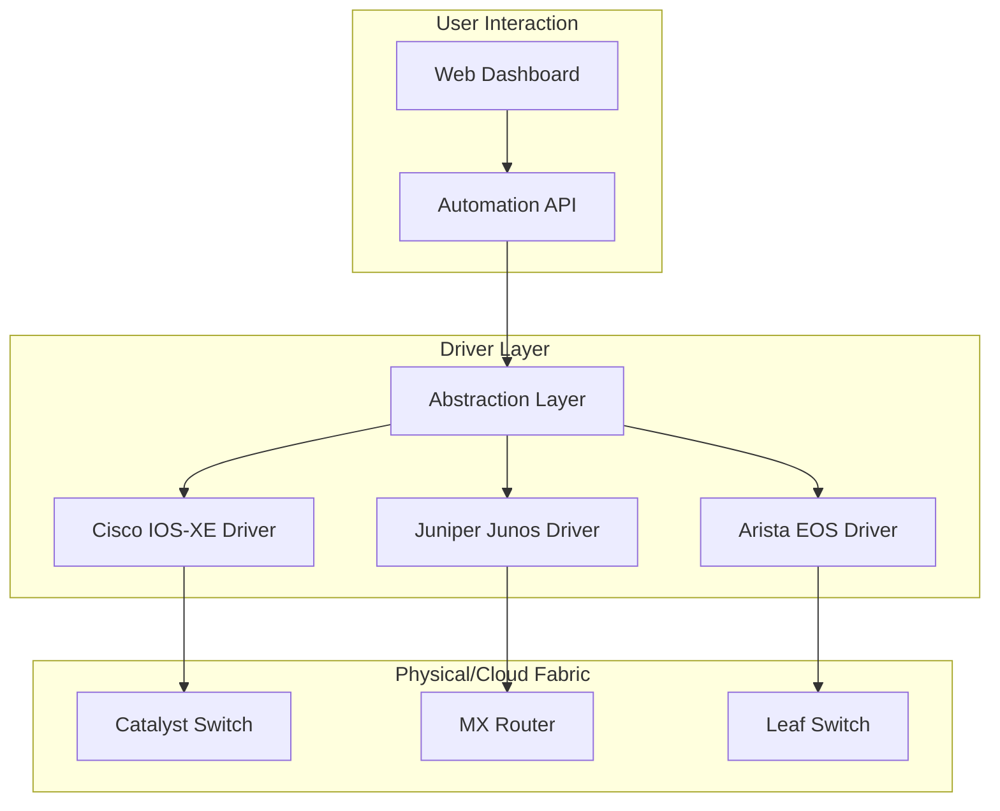
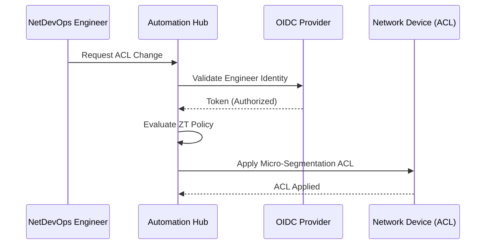
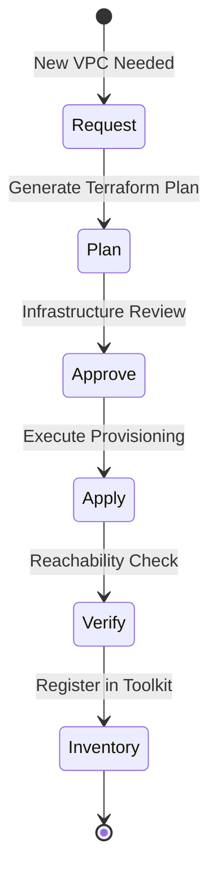

# Architecture & Security Diagrams

## 31. Multi-Vendor Driver Abstraction Architecture

```mermaid
graph TD
    subgraph "User Interaction"
        Web[Web Dashboard] --> API[Automation API]
    end
    subgraph "Driver Layer"
        API --> Driver[Abstraction Layer]
        Driver --> Cisco[Cisco IOS-XE Driver]
        Driver --> Junos[Juniper Junos Driver]
        Driver --> Arista[Arista EOS Driver]
    end
    subgraph "Physical/Cloud Fabric"
        Cisco --> Dev1[Catalyst Switch]
        Junos --> Dev2[MX Router]
        Arista --> Dev3[Leaf Switch]
    end
```

## 40. Zero Trust Network Enforcement Flow

```mermaid
sequenceDiagram
    participant User as NetDevOps Engineer
    participant Hub as Automation Hub
    participant IDP as OIDC Provider
    participant Dev as Network Device (ACL)

    User->>Hub: Request ACL Change
    Hub->>IDP: Validate Engineer Identity
    IDP-->>Hub: Token (Authorized)
    Hub->>Hub: Evaluate ZT Policy
    Hub->>Dev: Apply Micro-Segmentation ACL
    Dev-->>Hub: ACL Applied
```

## 50. Cloud Network Orchestration Flow (AWS VPC)

```mermaid
stateDiagram-v2
    [*] --> Request: New VPC Needed
    Request --> Plan: Generate Terraform Plan
    Plan --> Approve: Infrastructure Review
    Approve --> Apply: Execute Provisioning
    Apply --> Verify: Reachability Check
    Verify --> Inventory: Register in Toolkit
    Inventory --> [*]
```
