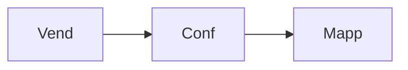
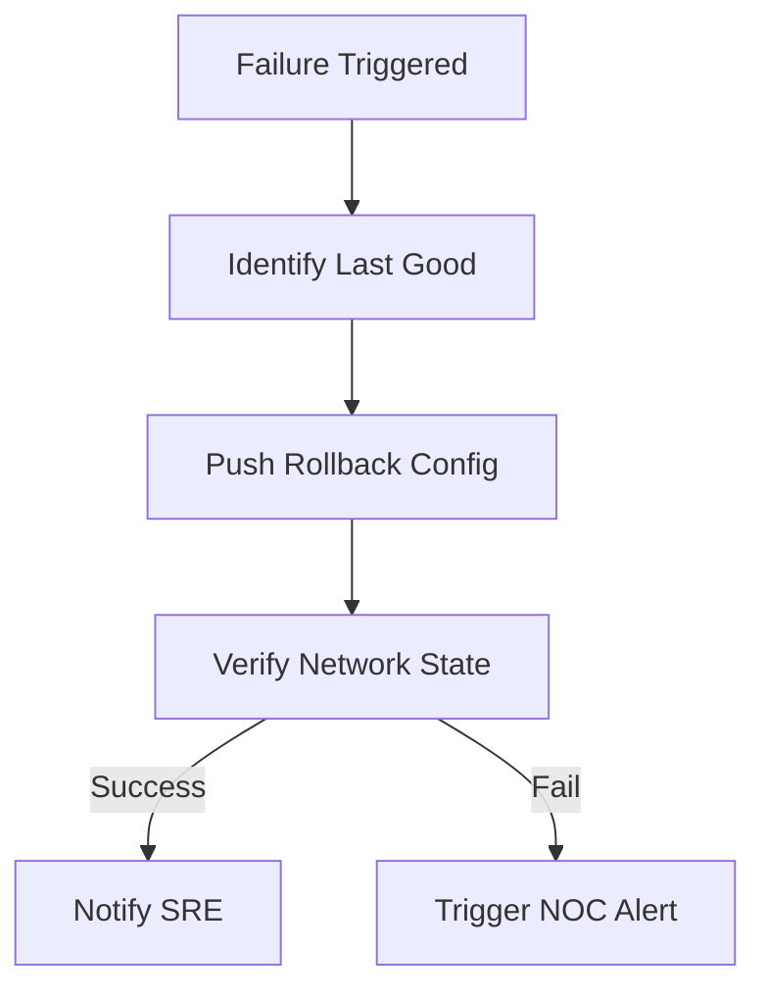
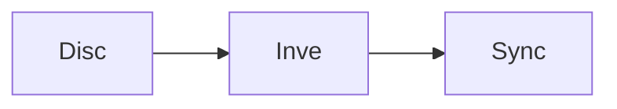

# Network Automation & Compliance Diagrams

## 11. Industrial NetDevOps Lifecycle (Detailed)
*The end-to-end orchestration of network intent, configuration, and validation.*

```mermaid
graph TD
    subgraph "Phase 1: Intent & Design"
        I1[Define Desired State]
        I2[Template Creation]
        I3[Policy Mapping]
    end
    subgraph "Phase 2: Validation & Simulation"
        V1[Pre-Check Scripts]
        V2[GNS3/EVENG Simulation]
        V3[Dry Run Analysis]
    end
    subgraph "Phase 3: Provisioning"
        P1[Config Push (Netmiko)]
        P2[API Call (Cisco DNA)]
        P3[State Capture]
    end
    subgraph "Phase 4: Post-Validation"
        A1[Post-Check Scripts]
        A2[Drift Analysis]
        A3[Compliance Verification]
    end
    subgraph "Phase 5: Governance & Audit"
        G1[Audit Log Storage]
        G2[Compliance Reporting]
        G3[Rollback if Needed]
    end

    I1 --> I2 --> I3 --> V1 --> V2 --> V3 --> P1 --> P2 --> P3 --> A1 --> A2 --> A3 --> G1 --> G2 --> G3
```

## 15. Cross-vendor configuration mapping


## 20. Automated rollback state machine


## 25. Device discovery & inventory sync

